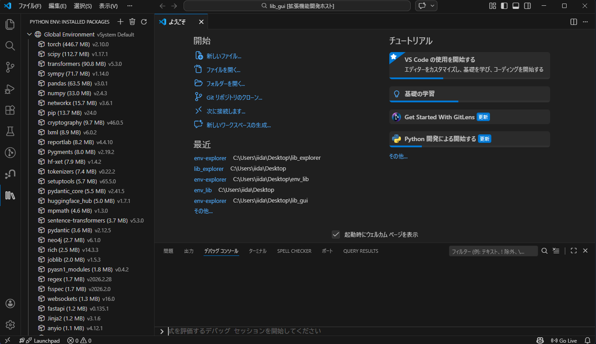
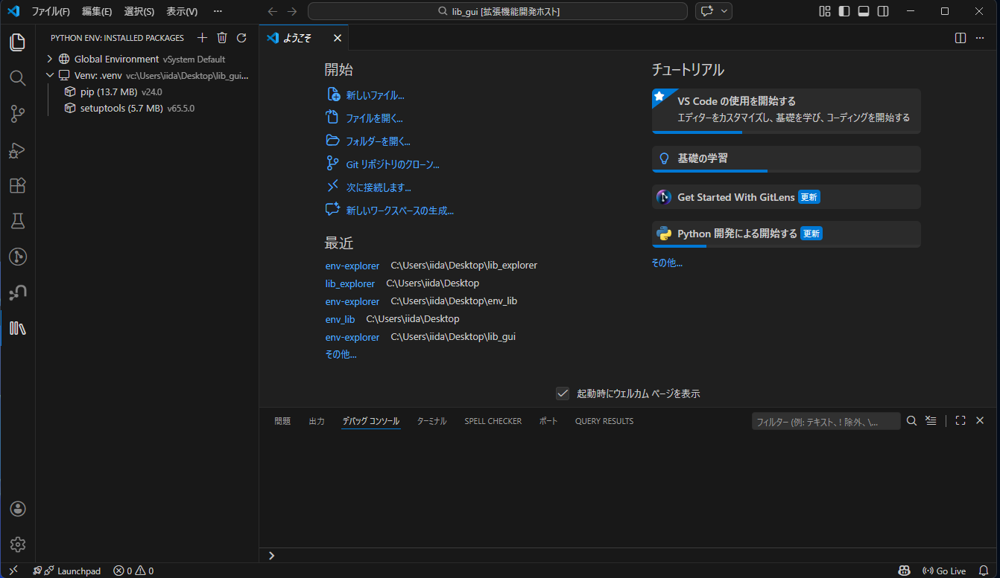

# Python Env & Package Size Explorer 📦

Visualize your Python package sizes and manage multiple virtual environments with ease. This extension helps you identify "heavy" packages and keep your development environment lean.

## Features

- 📊 **Size Visualization**: See exactly how much disk space each package occupies.
- 🏗️ **Smart Venv Creation**: Create virtual environments with custom names and your choice of Python version.
- 🗑️ **Bulk Uninstall**: Select multiple packages and remove them all at once.
- ↩️ **Multi-level Undo**: Accidentally deleted something? Restore your packages from the history stack.
- 🐍 **Auto Detection**: Automatically detects all virtual environments within your workspace folder.

## How to Use

1. Open a Python project folder.
2. Click the **Python Env** (library icon) in the Activity Bar.
3. Browse your global and virtual environments.
4. Use the top menu icons to **Refresh**, **Create Venv**, or **Undo**.

## 💡 Tips for Windows Users

- **File Lock Notice**: Immediately after creating a `.venv`, VS Code or the Python extension may background-scan the folder. If you cannot move the folder to the Recycle Bin immediately, please wait a few seconds for the scan to complete.
- **Refresh**: If the package list doesn't update immediately after a pip command, click the **Refresh** icon.

## Screenshots

## Requirements

- VS Code 1.80.0+
- Python 3.3+
- [Microsoft Python Extension](https://marketplace.visualstudio.com/items?itemName=ms-python.python) (Recommended)

## Support & Feedback 🐛

If you find a bug or have a feature request, please open an issue on GitHub:
👉 [GitHub Issues](https://github.com/IDNBC/env-explorer/issues)

## License
MIT